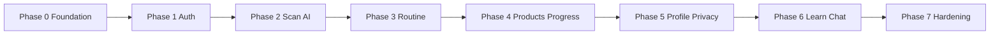

# SkinSense — Implementation Plan

> Derived from [REQUIREMENTS.md](./REQUIREMENTS.md)  
> **Target:** Project complete **June 20, 2026** · App Store launch **June 27, 2026**  
> **Stack:** React Native 0.74+ (Expo bare), TypeScript strict, Zustand + TanStack Query v5

This plan is organized **one section per screen/page**, with shared foundation first, then recommended build order and cross-cutting requirements.

---

## Table of Contents

1. [Executive Summary](#1-executive-summary)
2. [Foundation (Build Before Pages)](#2-foundation-build-before-pages)
3. [Page Plans](#3-page-plans)
   - [3.1 SplashScreen](#31-splashscreen)
   - [3.2 WelcomeScreen](#32-welcomescreen)
   - [3.3 LoginScreen](#33-loginscreen)
   - [3.4 SignupScreen](#34-signupscreen)
   - [3.5 SkinQuizScreen](#35-skinquizscreen)
   - [3.6 QuizResultsScreen](#36-quizresultsscreen)
   - [3.7 ScanGuideScreen](#37-scanguidescreen)
   - [3.8 CameraScreen](#38-camerascreen)
   - [3.9 AnalyzingScreen](#39-analyzingscreen)
   - [3.10 SkinReportScreen](#310-skinreportscreen)
   - [3.11 ReportDetailScreen](#311-reportdetailscreen)
   - [3.12 RoutineRevealScreen](#312-routinerevealscreen)
   - [3.13 HomeScreen](#313-homescreen)
   - [3.14 RoutineScreen](#314-routinescreen)
   - [3.15 RoutineStepScreen](#315-routinestepscreen)
   - [3.16 EditRoutineScreen](#316-editroutinescreen)
   - [3.17 ProductsScreen](#317-productsscreen)
   - [3.18 ProductDetailScreen](#318-productdetailscreen)
   - [3.19 IngredientScannerScreen](#319-ingredientscannerscreen)
   - [3.20 ProgressScreen](#320-progressscreen)
   - [3.21 CompareScreen](#321-comparescreen)
   - [3.22 LearnScreen](#322-learnscreen)
   - [3.23 ArticleScreen](#323-articlescreen)
   - [3.24 AIChatScreen](#324-aichatscreen)
   - [3.25 ProfileScreen](#325-profilescreen)
   - [3.26 EditProfileScreen](#326-editprofilescreen)
   - [3.27 SkinProfileScreen](#327-skinprofilescreen)
   - [3.28 PrivacyScreen](#328-privacyscreen)
   - [3.29 SettingsScreen](#329-settingsscreen)
4. [Recommended Build Phases](#4-recommended-build-phases)
5. [Cross-Cutting Requirements](#5-cross-cutting-requirements)
6. [Launch & QA Gates](#6-launch--qa-gates)

---

## 1. Executive Summary

### Product goal
SkinSense delivers AI skin analysis from a selfie, personalized AM/PM routines, ingredient-aware product matching, and long-term progress tracking — **photos stay on-device**; only anonymized score vectors go to the cloud when needed.

### Happy path (first session)
```
Splash → Auth (Welcome / Signup) → Skin Quiz → Scan Guide → Camera → Analyzing
  → Skin Report → Routine Reveal → Main (Home loop)
```

### Screen inventory

| # | Screen | Navigator | P0 |
|---|--------|-----------|-----|
| 1 | SplashScreen | Root | ✓ |
| 2 | WelcomeScreen | Auth | ✓ |
| 3 | LoginScreen | Auth | ✓ |
| 4 | SignupScreen | Auth | ✓ |
| 5 | SkinQuizScreen | Onboarding | ✓ |
| 6 | QuizResultsScreen | Onboarding | ✓ |
| 7 | ScanGuideScreen | Onboarding + Scan tab | ✓ |
| 8 | CameraScreen | Onboarding + Scan tab | ✓ |
| 9 | AnalyzingScreen | Onboarding + Scan tab | ✓ |
| 10 | SkinReportScreen | Onboarding + Scan tab | ✓ |
| 11 | ReportDetailScreen | Stack (from report) | ✓ |
| 12 | RoutineRevealScreen | Onboarding | ✓ |
| 13 | HomeScreen | Main tab | ✓ |
| 14 | RoutineScreen | Main tab | ✓ |
| 15 | RoutineStepScreen | Routine stack | ✓ |
| 16 | EditRoutineScreen | Routine stack | P1 |
| 17 | ProductsScreen | More drawer | ✓ |
| 18 | ProductDetailScreen | Products stack | ✓ |
| 19 | IngredientScannerScreen | Products stack | P1 |
| 20 | ProgressScreen | Main tab | ✓ |
| 21 | CompareScreen | Progress stack | P1 |
| 22 | LearnScreen | More drawer | P1 |
| 23 | ArticleScreen | Learn stack | P1 |
| 24 | AIChatScreen | Learn stack | P1 |
| 25 | ProfileScreen | More drawer | ✓ |
| 26 | EditProfileScreen | Profile stack | ✓ |
| 27 | SkinProfileScreen | Profile stack | ✓ |
| 28 | PrivacyScreen | Profile stack | ✓ |
| 29 | SettingsScreen | Profile stack | ✓ |

*P0 = required for June 20 MVP per launch checklist. P1 = strong V1.0 but can ship shortly after core loop if schedule slips.*

### Screens in nav but not fully spec’d in §6
**QuizResultsScreen** and **RoutineRevealScreen** appear in project structure and `OnboardingNavigator`; plans below infer behavior from flow and adjacent screens.

---

## 2. Foundation (Build Before Pages)

Complete these once; every page depends on them.

### 2.1 Project bootstrap
- [ ] Expo bare workflow RN 0.74+, TypeScript strict, folder layout per REQUIREMENTS §3
- [ ] `.env.example` with `API_BASE_URL`, Auth0, Mixpanel, Sentry, Firebase
- [ ] Providers: `AuthProvider`, `ThemeProvider`, `QueryProvider` in `src/app/providers/`

### 2.2 Design system (`src/theme/`)
- [ ] `colors.ts`, `typography.ts`, `spacing.ts`, `shadows.ts`, `index.ts`
- [ ] Bundle DM Sans + Space Mono fonts
- [ ] Light/dark theme tokens wired to `uiStore.theme`

### 2.3 UI primitives (`src/components/ui/`)
Build in order: `Button`, `Card`, `Input`, `Badge`, `ProgressBar`, `Chip`, `Avatar`, `Divider`, `Skeleton`, `Toast`, `Modal`, `Sheet`

### 2.4 Domain components (as needed per page)
| Component | Used on |
|-----------|---------|
| `SkinScoreRing`, `FaceMap`, `ConcernTag`, `SkinTypeCard`, `TrendChart` | Report, Home, Progress |
| `RoutineStepCard`, `RoutineTimeline`, `StreakBadge` | Routine, Home |
| `ProductCard`, `MatchScoreBadge`, `IngredientPill` | Products, Report detail |
| `Header`, `SafeArea`, `LoadingOverlay`, `EmptyState` | All |

### 2.5 Navigation (`src/app/navigation/`)
- [ ] `types.ts` — param lists for every screen
- [ ] `RootNavigator` — Splash → Auth | Onboarding | Main
- [ ] `AuthNavigator`, `OnboardingNavigator`, `MainNavigator` (bottom tabs + nested stacks + More drawer)
- [ ] Bottom tab bar spec: 64px, elevated Scan pill, MaterialCommunityIcons
- [ ] ErrorBoundary per navigator (§16)
- [ ] Deep link map for notifications (§13)

### 2.6 State & API
| Layer | Files | Responsibility |
|-------|-------|----------------|
| Zustand | `authStore`, `skinStore`, `routineStore`, `onboardingStore`, `uiStore` | Session, scan, routine, quiz, UI |
| TanStack Query | `queryKeys.ts` + hooks | Server cache |
| API | `client.ts` + domain modules | Axios + interceptors (401 → Login) |
| Secure | `secureStorage.ts` (Keychain) | JWT |
| Local | `mmkv.ts` | onboarding flag, chat cache, guest mode |

### 2.7 AI & camera services
- [ ] `modelLoader.ts`, `preprocessor.ts`, `skinAnalyzer.ts` (TFLite + MediaPipe alignment)
- [ ] `useCamera.ts`, `useSkinAnalysis.ts`
- [ ] `skinScore.ts` — weighted concern → 0–100 score

### 2.8 Analytics & errors
- [ ] `analytics.ts` — Mixpanel wrapper
- [ ] Sentry + global offline banner

---

## 3. Page Plans

Each page section includes: **file**, **purpose**, **prerequisites**, **layout/tasks**, **data**, **navigation**, **acceptance criteria**, **analytics**, **tests**.

---

### 3.1 SplashScreen

| | |
|---|---|
| **File** | `src/screens/onboarding/SplashScreen.tsx` |
| **Route** | `RootNavigator` initial route |
| **Purpose** | Boot: validate auth, load local state, route to Auth / Onboarding / Main |

#### Prerequisites
- MMKV, Keychain, `GET /auth/me`, `authStore`, minimum 1.5s timer

#### Implementation tasks
1. Full-screen `colors.primary`, centered logo SVG + tagline, Lottie leaf pulse
2. On mount: read token from Keychain → if present, `GET /auth/me`
3. Branch: valid token + `onboardingComplete` (MMKV) → `MainNavigator`; valid + incomplete → `OnboardingNavigator`; no/invalid token → `AuthNavigator`
4. Enforce `max(duration, 1500ms)` before navigate
5. On 401/expired: clear Keychain + MMKV auth flags → `LoginScreen` (via Auth)
6. On network error during validation: treat as unauthenticated → Auth (per edge case)

#### Data
- Reads: Keychain JWT, MMKV `onboardingComplete`
- Writes: none (except clear on expired token)

#### Acceptance criteria
- [ ] Never flashes wrong navigator on slow network
- [ ] Cold start to next screen feels branded (≥1.5s on fast devices)
- [ ] Expired token lands on Login with clean storage

#### Analytics
- `app_opened` (source: organic) — after route decision, not on Splash itself

#### Tests
- Unit: routing matrix (token × onboarding × network error)
- E2E: cold start with stored session (Detox flow 2)

---

### 3.2 WelcomeScreen

| | |
|---|---|
| **File** | `src/screens/onboarding/WelcomeScreen.tsx` |
| **Route** | `AuthNavigator` |
| **Purpose** | Value prop before signup; guest path |

#### Prerequisites
- Reanimated carousel, Moti float, gradient background

#### Implementation tasks
1. Gradient `primary` → `primaryDark`
2. 3-slide carousel with pagination dots:
   - Know Your Skin (face + scan lines)
   - Routines Built for You
   - Track Real Progress (before/after)
3. Slide enter: fade + translate; illustration Moti loop
4. CTAs: **Get Started** → Signup; **I already have an account** → Login; **Continue as Guest** → SkinQuiz (set guest flag in `onboardingStore`, prompt signup later)

#### Data
- Guest flag in MMKV/Zustand (limited mode — define: no cloud sync until signup)

#### Acceptance criteria
- [ ] All three CTAs navigate correctly
- [ ] Guest reaches quiz without auth token

#### Analytics
- `onboarding_started` on first slide view or Get Started

---

### 3.3 LoginScreen

| | |
|---|---|
| **File** | `src/screens/auth/LoginScreen.tsx` |
| **Route** | `AuthNavigator` |

#### Prerequisites
- Auth0 SDK, React Hook Form + Zod, `POST /auth/login`, Keychain

#### Implementation tasks
1. Layout: back, small logo, "Welcome back", email/password, forgot password (Auth0 browser), Sign In, social (Apple/Google), footer signup link
2. Biometric button if enabled in Settings + device support
3. Zod: email format, password min 8
4. Submit → login → store JWT → route by `user.onboardingComplete`
5. Errors: inline wrong credentials; Toast network; lockout countdown UI

#### Data
- `authStore.login`, Keychain, `GET /auth/me` after login

#### Acceptance criteria
- [ ] 401 shows inline error, not crash
- [ ] Successful login respects onboarding vs Main
- [ ] Biometric only when previously enabled

#### Analytics
- (implicit) returning user — track after successful login via `app_opened`

#### Tests
- E2E flow 2: Login existing account
- Component: form validation messages

---

### 3.4 SignupScreen

| | |
|---|---|
| **File** | `src/screens/auth/SignupScreen.tsx` |
| **Route** | `AuthNavigator` |

#### Implementation tasks
1. Mirror Login layout: name (first/last), email, password, confirm, terms checkbox (linked URLs)
2. Zod + blur check `GET /auth/check-email`
3. Password: 8+, 1 upper, 1 number; confirm match; terms required
4. `POST /auth/signup` → JWT → `onboardingComplete = false` in MMKV → **SkinQuizScreen**

#### Data
- Creates user backend-side; `onboardingStore` reset

#### Acceptance criteria
- [ ] Duplicate email caught on blur
- [ ] Terms must be checked to submit
- [ ] Lands on quiz, not Main

#### Analytics
- Part of onboarding funnel (quiz_completed later)

#### Tests
- E2E flow 1 start: Signup → Quiz

---

### 3.5 SkinQuizScreen

| | |
|---|---|
| **File** | `src/screens/onboarding/SkinQuizScreen.tsx` |
| **Route** | `OnboardingNavigator` (also reachable as guest) |

#### Implementation tasks
1. Progress bar (1–5), one question per view, large cards (multi-select where noted)
2. Back on questions 2–5; Skip on Q4–5 only
3. Questions 1–5 exactly as REQUIREMENTS §6.5 (concerns multi max 3, goals multi max 2, etc.)
4. Persist answers in `onboardingStore` on each step
5. On finish → navigate **QuizResultsScreen** (or POST `/users/quiz` if authenticated — see Results screen)

#### Data
- `onboardingStore.quizAnswers`, `POST /users/quiz` when logged in

#### Acceptance criteria
- [ ] Multi-select limits enforced
- [ ] Progress reflects step index
- [ ] Answers survive back navigation

#### Analytics
- `quiz_completed` with answer payload on finish

---

### 3.6 QuizResultsScreen

| | |
|---|---|
| **File** | `src/screens/onboarding/QuizResultsScreen.tsx` |
| **Route** | `OnboardingNavigator` (inferred — not in §6 text) |

#### Purpose (inferred)
Summarize quiz selections, set expectations before first scan, reinforce personalization.

#### Implementation tasks
1. Show top concerns + skin type selection as chips/cards
2. Copy: "We'll personalize your scan and routine based on this"
3. Primary CTA → **ScanGuideScreen**
4. If authenticated: `POST /users/quiz` with final answers (if not sent on last quiz step)
5. Secondary: "Edit answers" → back to quiz step 1

#### Data
- `onboardingStore.quizAnswers`

#### Acceptance criteria
- [ ] Reflects all quiz answers accurately
- [ ] CTA leads to scan guide

---

### 3.7 ScanGuideScreen

| | |
|---|---|
| **File** | `src/screens/scan/ScanGuideScreen.tsx` |
| **Route** | Onboarding stack + **Scan** tab stack |

#### Implementation tasks
1. Illustration + 4 tip cards (lighting, makeup, expression, distance)
2. CTA "I'm Ready — Open Camera" → request camera permission → **CameraScreen**
3. Toggle "Skip tips next time" → MMKV preference
4. If skip enabled on return → optional shortcut to camera (product decision: auto-skip or one-tap)

#### Permissions
- Camera requested here, not at app launch (§11)

#### Acceptance criteria
- [ ] Denied camera → explanation sheet → Settings link
- [ ] Works identically from onboarding and Scan tab

#### Analytics
- `scan_initiated` on CTA tap

---

### 3.8 CameraScreen

| | |
|---|---|
| **File** | `src/screens/scan/CameraScreen.tsx` |
| **Route** | Onboarding + Scan tab |

#### Prerequisites
- `react-native-vision-camera` v4, TFLite frame processor, MediaPipe face mesh, `useCamera`

#### Implementation tasks
1. Full-screen front camera, oval overlay (green when aligned)
2. Feedback strings: Move closer / Good light / Center / Hold still
3. Lighting bars (3), shutter disabled until aligned
4. Auto-capture after 2s stable alignment + 3-2-1 countdown; manual shutter always available
5. Capture ≥1080×1080; preprocess (brightness, face crop); cache locally **do not upload**
6. Run on-device TFLite preliminary pass → navigate **AnalyzingScreen** with `imageUri` + preliminary results
7. Close → pop stack

#### Data
- `skinStore.setScanImage(uri)`, local image cache only

#### Performance
- Camera preview &lt; 1s (§15)

#### Acceptance criteria
- [ ] Permission denied flow tested
- [ ] Background/foreground during session (manual QA)
- [ ] Image never sent to S3/API

#### Tests
- Manual QA on iPhone 14, Pixel 7, SE
- E2E: onboarding scan path

---

### 3.9 AnalyzingScreen

| | |
|---|---|
| **File** | `src/screens/scan/AnalyzingScreen.tsx` |
| **Route** | Onboarding + Scan tab |

#### Implementation tasks
1. Blurred capture as background, scan line animation, staged progress labels (5 stages, % ranges per §6.8)
2. Rotating skin facts every 2s
3. `runAsync` TFLite full inference; if confidence &lt; 0.7 → `POST /ai/analyze` with score vector only
4. `POST /scans` with vector + quiz context → persist `SkinAnalysisResult`
5. Min display 3s; then → **SkinReportScreen** with result params
6. Failure UI: retry + Contact support
7. Local notification optional: `scan_result_ready` (§13)

#### Data
- `skinStore.setAnalysisResult`, TanStack `skinReport` / `skinHistory` invalidation

#### Performance
- On-device analysis &lt; 4s target (§15)

#### Acceptance criteria
- [ ] Cloud fallback never sends raw image
- [ ] Progress never jumps backward
- [ ] Error retry returns to camera or re-runs inference

#### Analytics
- `scan_completed` with `scanId`, `skinScore`, `duration_ms`
- `first_scan_completed` when `onboarding` path

---

### 3.10 SkinReportScreen

| | |
|---|---|
| **File** | `src/screens/report/SkinReportScreen.tsx` |
| **Route** | Onboarding (first report) + Scan stack |

#### Prerequisites
- `SkinScoreRing`, `FaceMap`, `ConcernTag`, `SkinTypeCard`, `skinScore.ts`

#### Implementation tasks
1. **Score header:** photo, animated ring 0→score, label, skin type + Fitzpatrick, date, View History
2. **Skin type card:** icon, description, 3 chips
3. **Concerns:** all concerns incl. healthy; severity bars; tap → ReportDetail
4. **Face map:** zones tappable with tooltip
5. **What's working:** positive findings list
6. **Next steps:** 3 cards → Routine / Products / 7-day reminder
7. Sticky CTA: "See My Personalized Routine →" → **RoutineRevealScreen** (first time) or **RoutineScreen** (repeat scans)

#### Data
- Route params or `skinStore.latestAnalysis`; `GET /scans/:id` if deep-linked

#### Acceptance criteria
- [ ] Ring animates on mount
- [ ] Face map zones match `affectedZones` on concerns
- [ ] Offline: show last cached report (§16)

#### Analytics
- `first_scan_completed` / ongoing scan events already fired on Analyzing

#### Tests
- Component: FaceMap zone tap; SkinScoreRing animation
- E2E flow 1: reach report after scan

---

### 3.11 ReportDetailScreen

| | |
|---|---|
| **File** | `src/screens/report/ReportDetailScreen.tsx` |
| **Route** | Stack param: `concernId` |

#### Implementation tasks
1. Header: name + severity badge
2. Sections: What is this / Causes / Your result (from scan) / How to improve (3 tips)
3. Horizontal product cards (3–5) → ProductDetail
4. Learn more → ArticleScreen with concern tag

#### Data
- Concern from current `SkinAnalysisResult`; products via `GET /products?concern=`

#### Acceptance criteria
- [ ] Personalized "Your result" uses live scan data
- [ ] Products show match scores

---

### 3.12 RoutineRevealScreen

| | |
|---|---|
| **File** | `src/screens/routine/RoutineRevealScreen.tsx` (add to structure) |
| **Route** | `OnboardingNavigator` terminal step |

#### Purpose (inferred)
Celebrate first personalized routine after first report; transition to Main.

#### Implementation tasks
1. Fetch/generate routine: `GET /routine` or client-side rules (§7.2) then persist
2. Show AM + PM summary (collapsed step list or timeline)
3. Confetti / celebration animation (Moti/Reanimated)
4. CTA "Start My Routine" → set `onboardingComplete` true (MMKV + PATCH user) → `MainNavigator` Home
5. Request notification permission here (§11 — after first scan high point)

#### Data
- `routineStore` hydrate from API; `onboardingStore.completeOnboarding()`

#### Acceptance criteria
- [ ] Routine reflects quiz + analysis rules (SPF AM, retinol rules, etc.)
- [ ] Onboarding flag prevents re-entry to onboarding stack

#### Analytics
- `onboarding_completed`

---

### 3.13 HomeScreen

| | |
|---|---|
| **File** | `src/screens/home/HomeScreen.tsx` |
| **Route** | Main tab: Home |

#### Implementation tasks
1. **Header:** time-based greeting, date, streak badge, notification bell
2. **Score card:** ring, delta vs last scan, last scanned, Scan Now
3. **Today's routine:** AM/PM by clock, progress "2 of 5", first 3 unchecked steps, View Full Routine
4. **Weekly insight:** AI card if ≥2 scans (`GET /progress/summary` or AI digest)
5. **Quick actions:** Scan / Products / Progress / Chat
6. **Learn:** 2 article cards (`GET /articles` personalized)
7. **Community:** V1.0 placeholder "Coming soon"

#### Data
- `skinStore`, `routineStore`, TanStack: user, routine, articles, progress summary

#### Performance
- 60fps scroll, FlashList if list sections grow (§15)

#### Acceptance criteria
- [ ] Empty first-scan state shows CTA
- [ ] Streak matches backend + local rules (§7.4)
- [ ] Offline: last score + routine checkoffs work

#### Analytics
- `app_opened` from push (`streak_at_risk` → Home)
- Routine step events from embedded checkoffs

#### Tests
- E2E: Home → Scan → Report; routine checkoff streak (flow 4)

---

### 3.14 RoutineScreen

| | |
|---|---|
| **File** | `src/screens/routine/RoutineScreen.tsx` |
| **Route** | Main tab: Routine |

#### Implementation tasks
1. Segmented Morning / Evening, streak, session progress bar
2. `RoutineStepCard` list: order, icon, name, product rec, why, duration, check-off animation
3. Tap card → RoutineStepScreen
4. All complete → celebration state
5. Edit Routine → EditRoutineScreen
6. Empty: "Complete your first scan…"

#### Data
- `routineStore` + `GET /routine`; `POST /routine/complete` on sync

#### Acceptance criteria
- [ ] Check-offs persist offline, queue sync (§16)
- [ ] 70%+ steps counts for streak (§7.4)

#### Analytics
- `routine_step_completed`, `routine_fully_completed`

---

### 3.15 RoutineStepScreen

| | |
|---|---|
| **File** | `src/screens/routine/RoutineStepScreen.tsx` |
| **Route** | Param: `stepId` |

#### Implementation tasks
1. Step header, personalized why (scan references), how-to steps, dosage guide, AM/PM/frequency, pro tip
2. 3 product cards → ProductDetail
3. Mark as done → updates `routineStore` + back

#### Acceptance criteria
- [ ] Copy references user's concerns from latest analysis

---

### 3.16 EditRoutineScreen

| | |
|---|---|
| **File** | `src/screens/routine/EditRoutineScreen.tsx` |
| **Priority** | P1 |

#### Implementation tasks
1. AM/PM toggle, draggable list (long-press), enable/disable steps
2. Add step → bottom sheet picker
3. Reset to AI → confirm → `POST /routine/reset`
4. Save → `PATCH /routine` sticky button

#### Acceptance criteria
- [ ] Order persists after save and app restart

---

### 3.17 ProductsScreen

| | |
|---|---|
| **File** | `src/screens/products/ProductsScreen.tsx` |
| **Route** | More drawer |

#### Implementation tasks
1. Search, filter chips (skin type, concern, category, price, prefs), sort (match/rating/price)
2. 2-column FlashList of `ProductCard` with match badge, rating, price, Add to Routine
3. FAB → IngredientScannerScreen
4. Empty filter state copy

#### Data
- `GET /products` with `queryKeys.products(filters)`

#### Acceptance criteria
- [ ] Match score colors: &lt;60 warning, 80+ green (§7.3)
- [ ] Thumbnails &lt;300ms cached (FastImage)

#### Analytics
- `product_viewed` on card tap

#### Tests
- E2E flow 5: search, filter, detail, affiliate

---

### 3.18 ProductDetailScreen

| | |
|---|---|
| **File** | `src/screens/products/ProductDetailScreen.tsx` |
| **Route** | Param: `productId` |

#### Implementation tasks
1. Zoomable image, brand/name, category, animated match ring
2. "Why it matches" paragraph from user profile
3. Affiliate buttons (labeled), rating
4. Tabs: Overview / Ingredients (tooltips) / Reviews (skin type filter) / Alternatives
5. Sticky: Add to Routine (step picker sheet), Save bookmark

#### Data
- `GET /products/:id`

#### Analytics
- `product_affiliate_tapped`, `product_added_to_routine`

---

### 3.19 IngredientScannerScreen

| | |
|---|---|
| **File** | `src/screens/products/IngredientScannerScreen.tsx` |
| **Priority** | P1 |

#### Implementation tasks
1. Rear camera, guide overlay, ML Kit OCR on-device
2. Scan → `POST /products/ingredient-scan` with text
3. Bottom sheet: safety score, match score, color-coded ingredients, watch-outs, Save

#### Permissions
- Camera (same pattern as scan guide)

#### Analytics
- `ingredient_scanner_used`

---

### 3.20 ProgressScreen

| | |
|---|---|
| **File** | `src/screens/progress/ProgressScreen.tsx` |
| **Route** | Main tab: Progress |

#### Implementation tasks
1. Score trend chart (Victory Native) 30/90/180d toggle + annotations
2. Concern mini trends with % change
3. Photo timeline horizontal → CompareScreen
4. Milestones badge gallery
5. AI weekly digest section

#### Data
- `GET /progress/trends`, `GET /progress/summary`, `skinStore.analysisHistory`

#### Acceptance criteria
- [ ] Charts handle 0/1 scan gracefully

---

### 3.21 CompareScreen

| | |
|---|---|
| **File** | `src/screens/progress/CompareScreen.tsx` |
| **Priority** | P1 |

#### Implementation tasks
1. Side-by-side or slider reveal; date pickers per panel
2. Concern scores under each photo; delta table
3. Share Progress → generate image (privacy: scores optional)

#### Analytics
- `compare_screen_viewed`, `progress_photo_compared`

---

### 3.22 LearnScreen

| | |
|---|---|
| **File** | `src/screens/learn/LearnScreen.tsx` |
| **Priority** | P1 |

#### Implementation tasks
1. Search, filter tabs (All / For Your Skin / Ingredients / Routines / Trends)
2. Featured card + grid with badges
3. FAB "Ask AI" → AIChatScreen

#### Data
- `GET /articles`, `GET /articles/featured`

---

### 3.23 ArticleScreen

| | |
|---|---|
| **File** | `src/screens/learn/ArticleScreen.tsx` |
| **Route** | Param: `articleId`; deep link from notifications |

#### Implementation tasks
1. Hero, tag, read time, title, dermatologist badge
2. Markdown/rich body: ingredient taps, pull quotes, product callouts
3. Related to your skin + related articles carousel
4. Share action

#### Data
- `GET /articles/:id`; cache for offline read

#### Analytics
- `article_opened`

---

### 3.24 AIChatScreen

| | |
|---|---|
| **File** | `src/screens/learn/AIChatScreen.tsx` |
| **Priority** | P1 |

#### Implementation tasks
1. Chat UI: user right (`primaryPale`), AI left (logo avatar)
2. First-open disclaimer + suggested question chips
3. `POST /ai/chat` with last 10 messages + skin context from profile/scan
4. Persist history MMKV + backend sync
5. Guardrails: no medical diagnosis copy in system prompt

#### Data
- `skinStore`, `routineStore`, `queryKeys.chatHistory`

#### Offline
- Disabled with banner (§16)

#### Analytics
- `ai_chat_message_sent`

---

### 3.25 ProfileScreen

| | |
|---|---|
| **File** | `src/screens/profile/ProfileScreen.tsx` |
| **Route** | More drawer |

#### Implementation tasks
1. Avatar (tap → photo library permission), name, email, member since
2. Skin type + Fitzpatrick badges
3. Stats: scans, streak, adherence %
4. Menu rows → EditProfile, SkinProfile, Settings (notifs), Privacy, Settings, Help/Terms URLs, Sign out, Delete account

#### Data
- `GET /users/me`

#### Acceptance criteria
- [ ] Delete account confirms and calls backend delete flow
- [ ] Sign out clears Keychain + stores

---

### 3.26 EditProfileScreen

| | |
|---|---|
| **File** | `src/screens/profile/EditProfileScreen.tsx` |

#### Implementation tasks
1. Form: photo, names, email (re-auth to change), DOB, gender optional, skin goals multi-select
2. `PATCH /users/me` on save

---

### 3.27 SkinProfileScreen

| | |
|---|---|
| **File** | `src/screens/profile/SkinProfileScreen.tsx` |

#### Implementation tasks
1. Skin type with "Disagree?" feedback
2. Fitzpatrick highlight, top 5 concerns + trends, sensitivities, prefs
3. Retake quiz → SkinQuizScreen (update flow)
4. Scan history list with scores

---

### 3.28 PrivacyScreen

| | |
|---|---|
| **File** | `src/screens/profile/PrivacyScreen.tsx` |

#### Implementation tasks
1. Plain-language data collection list
2. Prominent on-device photo callout
3. Cloud data list (no photos)
4. Research toggle (default ON)
5. Export → `GET /users/me/export`
6. Delete all data → confirm → `DELETE /users/me/data`
7. Policy links (GDPR/CCPA)

#### Acceptance criteria
- [ ] GDPR delete E2E per launch checklist

---

### 3.29 SettingsScreen

| | |
|---|---|
| **File** | `src/screens/profile/SettingsScreen.tsx` |
| **Route** | Optional initial tab param for notifications |

#### Implementation tasks
1. **Notifications:** routine AM/PM toggles + time, weekly scan day, tips, restock — sync to FCM/local scheduler (§13, max 2/day, quiet hours)
2. **App:** theme, haptics, biometric toggle
3. **Routine:** default tab, auto-advance
4. **Data:** HealthKit/Health Connect optional, backup toggle, clear cache

#### Deep links
- Profile → Settings (notifs tab) per menu copy

---

## 4. Recommended Build Phases

### Phase 0 — Scaffold (Days 1–3)
Foundation §2: theme, UI primitives, navigation shells, API client, stores, Splash routing.

### Phase 1 — Auth & onboarding narrative (Days 4–8)
Welcome → Login → Signup → Quiz → QuizResults → ScanGuide (UI only).

### Phase 2 — Scan pipeline (Days 9–14) — **critical path**
Camera + TFLite + Analyzing + SkinReport + ReportDetail; cloud fallback; `POST /scans`.

### Phase 3 — Routine & first-time completion (Days 15–18)
Routine generation API, RoutineReveal, Routine + Step screens, Home integration, streak logic.

### Phase 4 — Main loop enrichment (Days 19–22)
Products + Detail, Progress (+ Compare), notifications permission + scheduling.

### Phase 5 — Profile, privacy, settings (Days 23–25)
Profile stack, GDPR export/delete, Settings + theme/dark mode.

### Phase 6 — Learn & chat (Days 26–28)
Learn, Article, AIChat (can slip to P1 if needed).

### Phase 7 — Hardening (June 18–20)
Ingredient scanner, EditRoutine, E2E, perf, Sentry, analytics audit, launch checklist.



---

## 5. Cross-Cutting Requirements

Apply on **every page** where relevant.

| Area | Requirement |
|------|-------------|
| **Styling** | `StyleSheet` + theme tokens only; no Tailwind |
| **Lists** | `@shopify/flash-list` for long lists |
| **Images** | `react-native-fast-image`; WebP from CDN for remote |
| **Forms** | React Hook Form + Zod |
| **Animations** | Reanimated 3 + Moti for rings, checkoffs, celebrations |
| **Errors** | Navigator ErrorBoundary; API toasts per §16 |
| **Offline** | Banner; queue routine completions; disable scan/chat/search |
| **Accessibility** | Touch targets ≥44pt; labels on icon-only buttons |
| **Dark mode** | All screens — manual QA item |
| **i18n** | Full app UI localized (10 locales, ~474 keys) |
| **Security** | JWT in Keychain; never log tokens or images |
| **Privacy** | Photos local only; score vector only to cloud |

### Hooks to implement early

| Hook | Consumers |
|------|-----------|
| `useAuth` | Splash, Login, Profile |
| `useSkinAnalysis` | Camera, Analyzing, Report |
| `useRoutine` | Home, Routine, Step, Edit |
| `useProgress` | Progress, Compare, Home insight |
| `useProducts` | Products, Detail, Scanner, Report detail |
| `useNotifications` | Settings, RoutineReveal, deep links |
| `useHealthKit` | Settings only |

### Backend contract checklist (no mocks in prod)
All endpoints in REQUIREMENTS §10 must have typed clients in `src/services/api/*` before marking a page "done."

---

## 6. Launch & QA Gates

### Per-page definition of done
- [ ] Matches layout & actions in REQUIREMENTS §6
- [ ] Loading, empty, and error states implemented
- [ ] Analytics events wired (§14)
- [ ] Works in light + dark theme
- [ ] Tested on one iOS + one Android device
- [ ] No mock data in production code path

### Project-level gates (June 20)
- [ ] All P0 screens above
- [ ] TFLite on real devices
- [ ] E2E flows 1–6 passing (§17)
- [ ] Performance table §15 met
- [ ] Push + deep links
- [ ] Sentry + Mixpanel live

### Store submission (June 21–27)
Follow REQUIREMENTS §18 (screenshots, privacy nutrition label, TestFlight, Play internal track).

---

## Appendix A — Page → API mapping

| Page | Primary endpoints |
|------|-------------------|
| Splash | `GET /auth/me` |
| Login/Signup | `POST /auth/login`, `POST /auth/signup`, `GET /auth/check-email` |
| SkinQuiz | `POST /users/quiz` |
| Analyzing | `POST /ai/analyze`, `POST /scans` |
| SkinReport | `GET /scans/:id`, `GET /scans` |
| ReportDetail | `GET /products?concern=` |
| RoutineReveal/Routine | `GET /routine`, `POST /routine/reset` |
| Routine (checkoff) | `POST /routine/complete` |
| EditRoutine | `PATCH /routine` |
| Products | `GET /products`, `GET /products/search` |
| ProductDetail | `GET /products/:id` |
| IngredientScanner | `POST /products/ingredient-scan` |
| Progress | `GET /progress/summary`, `GET /progress/trends` |
| Learn/Article | `GET /articles`, `GET /articles/:id`, `GET /articles/featured` |
| AIChat | `POST /ai/chat` |
| Profile/Edit | `GET /users/me`, `PATCH /users/me` |
| Privacy | `GET /users/me/export`, `DELETE /users/me/data` |

---

## Appendix B — Page → Zustand / Query keys

| Page | Store | Query key |
|------|-------|-----------|
| Splash | auth, onboarding | `user` |
| Quiz | onboarding | — |
| Analyzing/Report | skin | `skinReport(id)`, `skinHistory` |
| Home | skin, routine | `user`, `routine`, `articles` |
| Routine* | routine | `routine(type)` |
| Products* | — | `products(filters)`, `product(id)` |
| Progress | skin | `progress` trends/summary |
| Chat | — | `chatHistory` |
| Profile | auth | `user` |

---

*Plan version: 1.0 — aligned with REQUIREMENTS.md (June 2026 MVP)*
